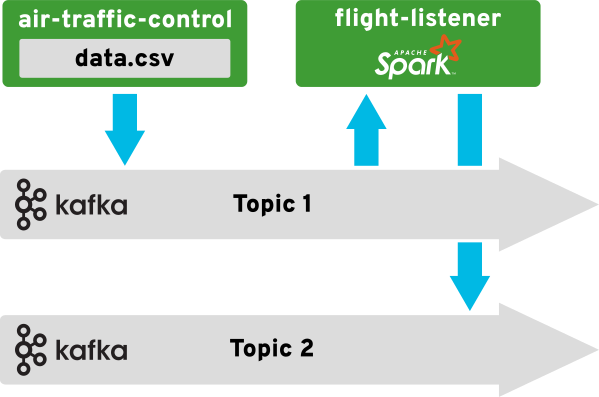

# Late Departures

This repository contains a few applications for creating a demonstration of
stream processing flight departure information using Apache Kafka, Apache
Spark, and OpenShift.

## Architecture

This diagram shows a high level overview of the components and data flow which
exist in this application pipeline.



The `air-traffic-control` application will broadcast flight departure
information that is contained within the `data.csv` file in its directory.
These details will be sent to a topic(eg "Topic 1") on a Kafka broker for
distribution

The `flight-listener` application will listen to a Kafka broker for messages
on a specified topic (eg "Topic 1). It will inspect any messages it receives
to determine if the flight in question has missed its scheduled departure
time. Any flight that has been found to have missed its scheduled departure
will then have its data broadcast onto a second topic (eg "Topic 2") with
the broker.

## Prerequisites

To run this demonstration you will need an OpenShift project and an instance
of Apache Kafka deployed in that project. If you not familiar with OpenShift,
please see the
[getting started section](https://docs.openshift.org/latest/getting_started/index.html)
of their documentation. To deploy Kafka in your OpenShift project please see
the [Strimzi project](http://strimzi.io/) as an excellent resource for
deployment options.

## OpenShift Quickstart

To begin deploying the late-departures application pipeline this document
assumes you have read the [prerequisites](#prerequisites) and have an
OpenShift login available and access to the `oc` command line utility.

### Overview

1. Create a new project in OpenShift

1. Deploy Apache Kafka

1. Install radananlytics.io manifest

1. Deploy air-traffic-control

1. Deploy flight-listener

### Detailed Instructions

#### Create a new project in OpenShift

This is not required but is recommended as a way to isolate your work and aid
in cleanup and redeployments. Create a new project with the command
`oc new-project myproject`.

#### Deploy Apache Kafka

The `air-traffic-control` and `flight-listener` applications will need access
to a Kafka broker. If you have Kafka brokers deployed you may use their
addresses for the applications.

If you do not have access to predeployed Kafka brokers, you can use the
templates available from the [Strimzi project](https://strimzi.io). For the
easiest deployment, the
[0.1.0 instructions](http://strimzi.io/docs/0.1.0/#deploying-to-openshift-1)
provide a method that does not require administrator roles. These deployments
might take a few minutes, ensure that all services are running and available
before proceeding.

**Wait for the Kafka brokers to be available before proceeding**

#### Install radanalytics.io manifest

For automated deployment of Apache Spark with the `flight-listener`
application, this pipeline uses the
[Oshinko project source-to-image](https://github.com/radanalyticsio/oshinko-s2i)
builder. To enable this builder we need to install the
[radanalytics.io](https://radanalytics.io/) community project manifest. Full
instructions can be found on the
[radanalytics.io Get Started page](https://radanalytics.io/get-started).

#### Deploy air-traffic-control

Detailed documentation for `air-traffic-control` can be found on its
[readme page](air-traffic-control/). The following command will build the
application from source and deploy it to OpenShift. You will need to
substitute your Apache Kafka broker addresses for the `kafka:9092` used in
this example.

```
oc new-app centos/python-36-centos7~https://github.com/elmiko/late-departures.git \
  -e KAFKA_BROKERS=kafka:9092 \
  -e KAFKA_TOPIC=flights \
  --context-dir=air-traffic-control \
  --name=air-traffic-control
```

#### Deploy flight-listener

Detailed documentation for `flight-listener` can be found on its
[readme page](flight-listener/). The following command will build the
application from source, deploy it to OpenShift, and deploy an Apache Spark
cluster bound to the application. You will need to substitute your Apache Kafka
broker addresses for the `kafka:9092` used in this example.

```
oc new-app --template=oshinko-python-spark-build-dc \
  -p APPLICATION_NAME=flight-listener \
  -p GIT_URI=https://github.com/elmiko/late-departures \
  -p CONTEXT_DIR=flight-listener \
  -e KAFKA_BROKERS=kafka:9092 \
  -e KAFKA_INTOPIC=flights \
  -e KAFKA_OUTTOPIC=late \
  -p SPARK_OPTIONS='--packages org.apache.spark:spark-streaming-kafka-0-8_2.11:2.1.0'
```

### Confirming operation

If you have tools available for listening to topic broadcasts on a Kafka
broker then you are all set to confirm that the late departures are being
re-broadcast on the second topic from the `flight-listener`.

If you do not have these tools available, the
[kafka-openshift-python-listener](https://github.com/bones-brigade/kafka-openshift-python-listener)
project is a simple way to print those messages. Be sure to use your Kafka
broker address and the re-broadcast topic to inspect those messages.

## Deployment Using the OpenShift Applier

Alternatively to the manual deployment of the core projects and supporting infrastructure, the project can be deployed using the [openshift-applier](https://github.com/redhat-cop/openshift-applier).

### Prerequisites

The following prerequisites must be satisfied:

1. [Ansible](https://www.ansible.com/)
2. OpenShift Command Line Interface (CLI)
3. OpenShift environment

### Deployment

Utilize the following steps to deploy the project

1. Clone the repository

    ```
    git clone https://github.com/elmiko/late-departures
    ```

2. Change into the project directory and utilize Ansible Galaxy to retrieve required dependencies

    ```
    ansible-galaxy install -r requirements.yml --roles-path=galaxy
    ``` 
 
3. Execute the _openshift-applier_

    ```
    ansible-playbook -i applier/inventory galaxy/openshift-applier/playbooks/openshift-cluster-seed.yml
    ```

Once complete, all of the resources should be available in OpenShift

### Customizing the Deployment

As part of the deployment, a series of templates are processed along with other resources. Each template contains an analogous parameter file in the [params](applier/params) folder that can be used to override the default parameters in the template. Feel free to modify these files and their values to customize the application deployment.
